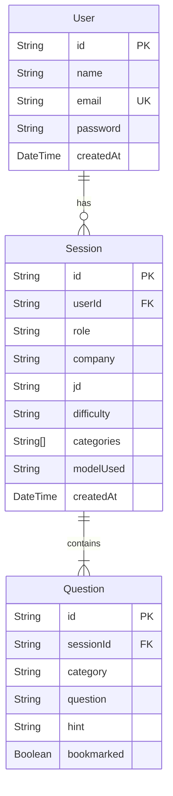
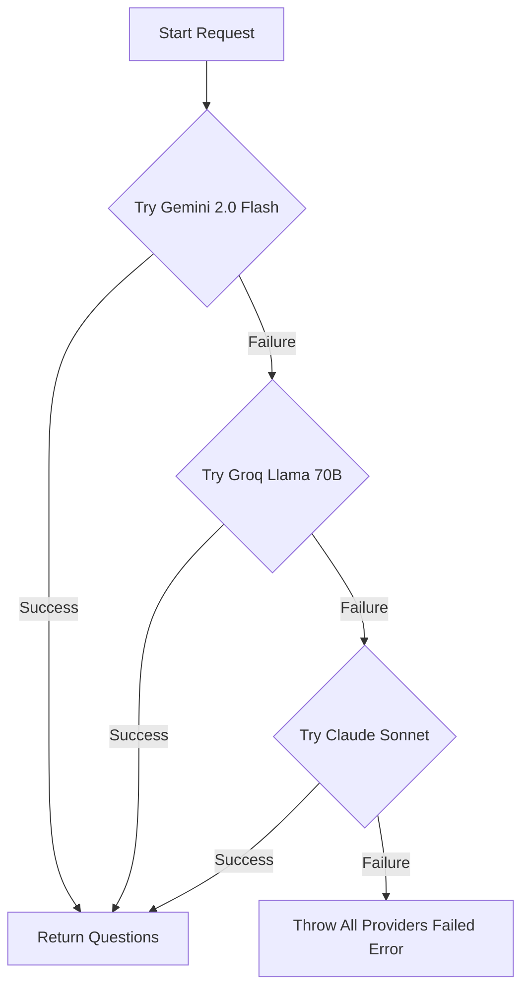

# PrepAI Implementation Plan ⚙️
> A Technical Reference for the Design, Architecture, and Implementation of PrepAI.

This document details the software architecture, data flows, and technical implementation choices for both the frontend (React/Vite/Tailwind) and backend (Express/Prisma/PostgreSQL) services.

---

## 1. Database Architecture & Schema

We use **Prisma ORM** with **PostgreSQL** to manage data persistence. The database consists of three primary tables: `User`, `Session`, and `Question`.



### Cascade Deletion
When a user deletes an interview history session, the associated questions must also be removed to prevent orphaned records in the database.
- Path: `server/routes/history.js`
- Operation: `prisma.question.deleteMany({ where: { sessionId: req.params.id } })` followed by `prisma.session.delete({ where: { id: req.params.id } })`.

---

## 2. Authentication Flow

PrepAI implements token-based authentication using **JSON Web Tokens (JWT)** and **bcryptjs**.

```text
[User Signup / Login] ──> (Bcrypt Hash / Validate) ──> [JWT Token Issued]
                                                           │
[Authenticated API Request] <── (Verify Header Token) <────┘
```

1. **Password Hashing**: In `server/routes/auth.js`, user passwords are encrypted using `bcrypt.hash(password, 10)` before insertion.
2. **Token Generation**: Upon successful login, the server signs a JWT containing the user's ID:
   ```javascript
   const token = jwt.sign({ userId: user.id }, process.env.JWT_SECRET, { expiresIn: '24h' });
   ```
3. **Authorization Middleware**: Any request to protected endpoints is intercepted by `server/middleware/authMiddleware.js`, which verifies the token:
   ```javascript
   const token = req.headers.authorization?.split(' ')[1];
   const decoded = jwt.verify(token, process.env.JWT_SECRET);
   req.userId = decoded.userId;
   ```

---

## 3. Resilient Multi-Provider AI Fallback Engine

AI generation endpoints are notoriously prone to rate limits, transient server errors, or capacity shortages. PrepAI implements an automatic sequential fallback strategy to guarantee 100% uptime.



### Prompt Strategy
The AI service enforces structured output by providing a strict JSON template inside the system prompt:
```javascript
const buildPrompt = (role, company, jd, categories, difficulty, count) => `
You are an expert technical interviewer...
Generate ${count} interview questions...
Return ONLY a valid JSON object, no extra text, no markdown, no backticks:
{
  "questions": [
    { "category": "DSA", "question": "question text", "hint": "hint text" }
  ]
}
`;
```

---

## 4. Frontend Architecture & Design System

The frontend is a single-page application (SPA) built using React 19, structured around a centralized authentication context and custom axios client.

### Core Layout & Components
- **Navbar**: Adaptive navigation bar that switches links and user profile indicators depending on the user's active session state.
- **ProtectedRoute**: Higher-order component wrapping pages that require authentication (Dashboard, Generator, Bookmarks, History). Redirects unauthenticated traffic to `/login`.
- **QuestionCard**: Modular card representing a generated question, managing local states for:
  - Hint visibility (expandable block with smooth height animations).
  - Bookmarked state (updates the backend database in the background).

### Global API Configuration (`prepAi/src/services/api.js`)
Axios is configured with two interceptors:
1. **Request Interceptor**: Automatically inserts the JWT token into the `Authorization` header on all outbound API requests.
2. **Response Interceptor**: Intercepts `401 Unauthorized` responses (indicating expired or invalid tokens) and automatically clears local storage credentials, redirecting the user to `/login`.

---

## 5. UI & Styling Guidelines

PrepAI employs a premium **Dark Glassmorphism** design theme to elevate the user experience.

- **Vibrant Accent Gradients**: Deep purples (`#8A2BE2`), vibrant indigos, and electric blues are used as backdrops and borders.
- **Glassmorphism Backdrop Filters**: Cards and input containers use transparent colors paired with `backdrop-filter: blur(12px)`.
- **Focus States**: Text inputs feature customized glow states (`box-shadow: 0 0 15px rgba(138, 43, 226, 0.4)`).
- **Shimmer Loaders**: Bookmarks and History items render an animated shimmer placeholder block while waiting for backend API resolution.
